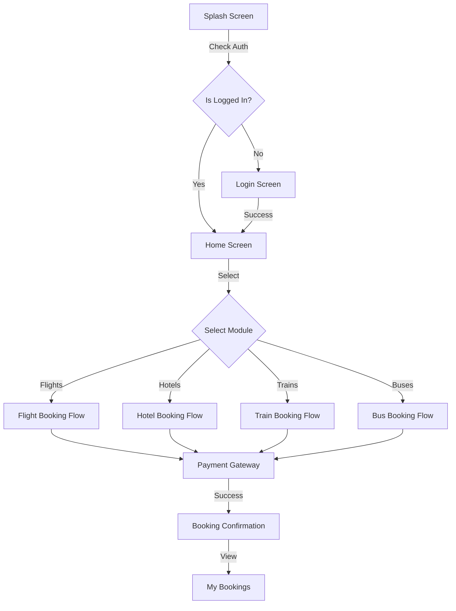
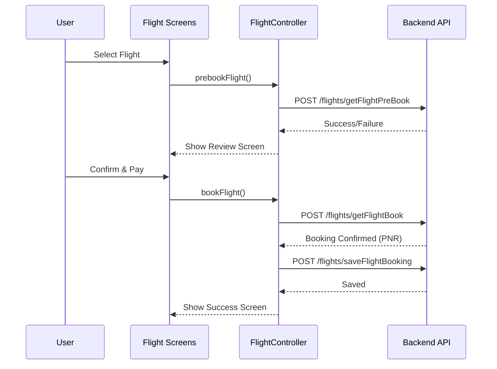

# Project Analysis & Deep Dive

This document provides a detailed technical analysis of the **SeeMyTrip** Flutter application. It complements the high-level `PROJECT_DOCUMENTATION.md` by offering granular insights into architecture, data flows, and code patterns.

## 1. Architectural Pattern: Feature-First with GetX

The project strictly follows a **Feature-First** architecture combined with **GetX** for state management. This structure ensures scalability and modularity.

### 1.1 Feature Structure
Each feature (e.g., `flights`, `hotels`) is a self-contained module containing its own:
-   **Data Layer**: Models and Repositories (though repositories are often merged into Controllers or Services in this project).
-   **Domain Layer**: (Optional) Business logic entities.
-   **Presentation Layer**:
    -   **Controllers**: GetXControllers managing state and business logic.
    -   **Screens**: UI Views.
    -   **Widgets**: Feature-specific reusable components.
    -   **Bindings**: Dependency injection setup for the feature.

### 1.2 Full Project Flow



### 1.3 State Management Pattern
-   **Reactive State**: Extensive use of `.obs` variables (`RxBool`, `RxList`, etc.).
-   **Controller Lifecycle**: Controllers are initialized via `Get.put()` or `Get.lazyPut()` within Bindings or directly in `onInit` of parent widgets.
-   **UI Updates**: `Obx(() => ...)` is used to listen to state changes and rebuild widgets efficiently.

### 1.3 Architecture Diagram

```mermaid
graph TD
    User[User Interaction] --> UI[UI Layer (Screens/Widgets)]
    UI --> Controller[GetX Controller]
    Controller --> Service[Service/API Layer]
    Service --> Backend[Backend API]
    Backend --> Service
    Service --> Controller
    Controller -- Updates State (.obs) --> UI
```

---

## 2. Core Data Flow Analysis

### 2.1 General Flow
1.  **UI Event**: User interacts with a Screen (e.g., clicks "Search Flights").
2.  **Controller Action**: The bound `GetxController` method is called (e.g., `FlightController.searchFlights()`).
3.  **Service Call**: The Controller calls an API endpoint defined in `AppConfig`.
    -   *Note*: The project uses a mix of `http` and `Dio` packages.
    -   `http` is used for Auth, Flights, and Hotels.
    -   `Dio` is used for Trains (likely due to legacy or specific interceptor needs).
4.  **Data Parsing**: JSON responses are parsed into Dart Models (e.g., `FlightSearchResponse`).
5.  **State Update**: Observable variables (`flightResults`, `isLoading`) are updated.
6.  **UI Rebuild**: `Obx` widgets detect the change and update the UI.

### 2.2 API Configuration (`AppConfig`)
-   **Base URLs**:
    -   `baseUrl`: `http://10.0.2.2:3002/api` (Localhost for Android Emulator)
    -   `baseUrl2`: Same as above (used for Trains).
-   **Endpoints**: All API routes are centralized in `lib/core/config/app_config.dart`.

---

## 3. Feature Deep Dive

### 3.1 Flights Module (`lib/features/flights`)
-   **Controller**: `FlightController`
    -   **Responsibilities**:
        -   Fetching airports (`fetchAirports`).
        -   Searching flights (`searchFlights`).
        -   Pre-booking validation (`prebookFlight`).
        -   Final booking (`bookFlight`).
        -   Saving booking to local DB (`saveFlightBooking`).
    -   **State**: Manages `flightResults`, `airports`, `totalPrice`, and `discount`.
-   **Search Logic**:
    -   Constructs a complex JSON body including `Adults`, `Children`, `Infants`, `Class`, etc.
    -   Handles both One-Way and Round-Trip logic via `flightType` ('O' vs 'R').
-   **Booking Flow**:
    1.  **Search**: User selects flights.
    2.  **Review**: `FlightReviewScreen` displays selection.
    3.  **Pre-Book**: API call `getFlightPreBook` validates price and availability.
    4.  **Payment**: Integration with Easebuzz/Razorpay.
    5.  **Book**: API call `getFlightBook` confirms the PNR.
    6.  **Save**: API call `saveFlightBooking` stores record in user history.

#### Flight Booking Sequence



### 3.2 Authentication Module (`lib/features/auth`)
-   **Controller**: `LoginController`
-   **Methods**:
    -   `signInWithGoogle()`: Uses `google_sign_in` and `firebase_auth`.
    -   `loginUser()`: Custom email/password login.
    -   `signUpUser()`: Registration flow.
    -   `updateUserProfile()`: Profile management.
-   **Token Management**: Access tokens are stored in `SharedPreferences` and attached to headers in `ApiService`.

### 3.3 Train Module (`lib/features/train`)
-   **Controller**: `TrainDetailController`
    -   **Responsibilities**:
        -   Searching trains (`getTrains`).
        -   Filtering results (`applyFilters`).
        -   Blocking seats (`blockSeats`).
    -   **State**: Manages `trains`, `_filteredTrains`, `isLoading`, and `selectedIndex` (date selection).
-   **Search Logic**:
    -   Takes `fromStnCode`, `toStnCode`, and `journeyDate`.
    -   Formats date to `yyyyMMdd` before sending to API.
    -   Updates `trains` observable with `trainBtwnStnsList` from response.
-   **Booking Flow**:
    1.  **Search**: User searches for trains between stations.
    2.  **Selection**: User selects a train and class.
    3.  **Passenger Details**: `TravellerDetailController` manages passenger info.
    4.  **Seat Block**: `blockSeats` calls `AppConfig.trainSeatBlock` to reserve seats.
    5.  **Payment & Confirmation**: (Handled in subsequent steps).

---

## 4. Dependency Analysis

### 4.1 Key Libraries
-   **State Management**: `get` (^4.6.6) - The backbone of the app.
-   **Networking**:
    -   `http` (^1.2.2) - Primary HTTP client.
    -   `dio` (^5.7.0) - Secondary client (Trains).
-   **Firebase**:
    -   `firebase_core`, `firebase_auth` - Authentication.
-   **UI/UX**:
    -   `flutter_svg` - Vector icons.
    -   `lottie` - Animations.
    -   `shimmer` - Loading skeletons.
    -   `carousel_slider` - Banners.
-   **Maps**:
    -   `google_maps_flutter` (implied by usage) & `flutter_map` (Leaflet) - Location services.
-   **Payment**:
    -   `razorpay_flutter`, `easebuzz_flutter` - Payment gateways.

---

## 5. Code Quality & Patterns

### 5.1 Strengths
-   **Separation of Concerns**: Clear distinction between UI and Logic.
    -   `features/bus`: ~30 files.

---

## 7. Future Scalability

To scale this project further, consider:
1.  **Repository Pattern**: Formally separate API calls from Controllers into Repository classes.
2.  **Freezed**: Use `freezed` for immutable data models.
3.  **Environment Flavors**: Use Flutter Flavors for Dev/Staging/Prod environments instead of commenting out URLs in `AppConfig`.
